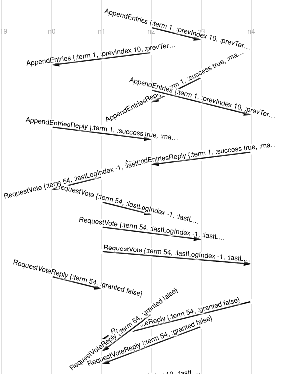
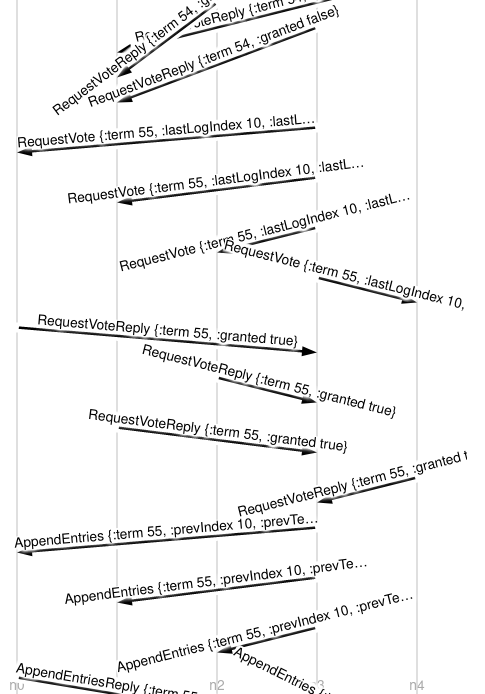

# Raft implementation
## A "toy implementation" of the [Raft](https://raft.github.io/) consensus algorithm, to be used with [Maelstrom](https://github.com/jepsen-io/maelstrom).

### Example showing leader exchange

O exemplo em questão aconteceu após ter havido uma partição de rede que separou o nó n1 dos restantes nodos da rede.

Entre os nodos n0, n2, n3 e n4 foi eleito líder o nodo n2, que recebeu alguns pedidos de clientes e os replicou pelos outros 3 nodos. Entretanto, o nodo n1, isolado, esteve constantemente a tentar tornar-se líder, incrementando o seu termo até ao valor 53. Voltando a juntar-se aos outros 3 nodos, o nodo n1 dá timeout e procura obter votos de uma maioria, mas recebe respostas negativas de todos (uma vez que neste ponto possui um log desatualizado).

Apercebendo-se de um nodo com um termo superior ao seu, o líder n2 reverte para o estado de follower. Posteriormente, um dos outros nodos (n3) dá timeout e (uma vez que possui o log consistente com o de uma maioria) torna-se o novo líder (no termo 55).
